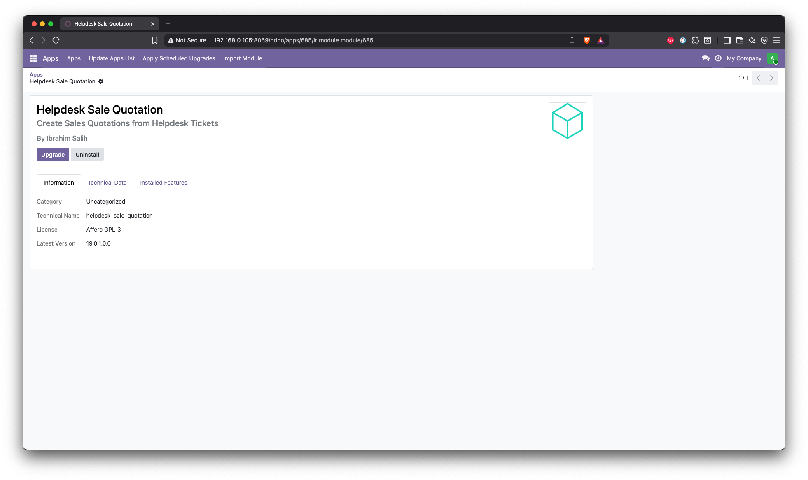
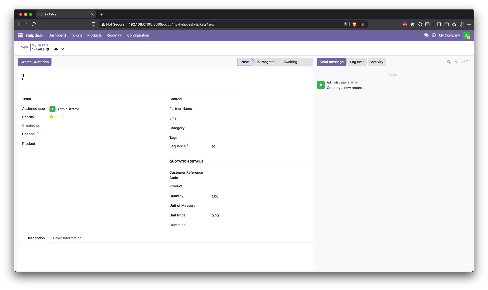
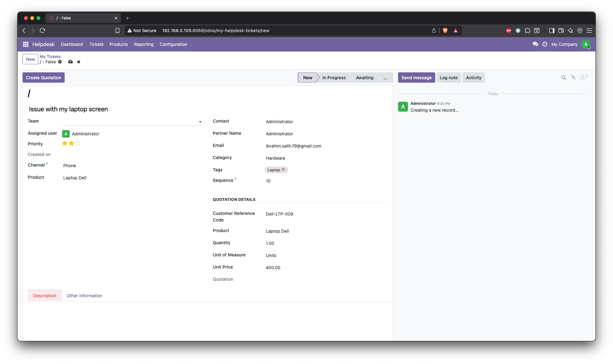
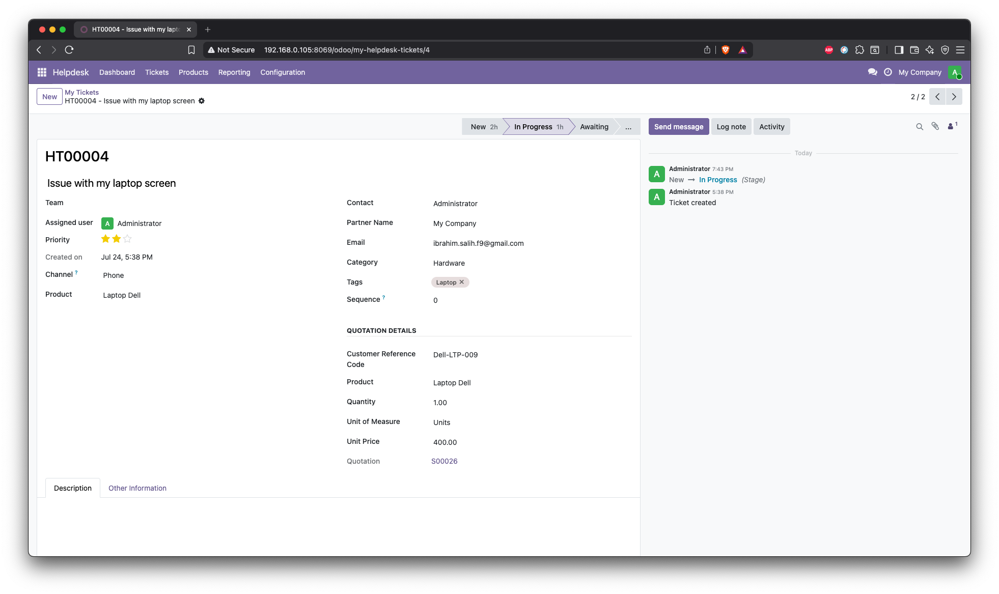
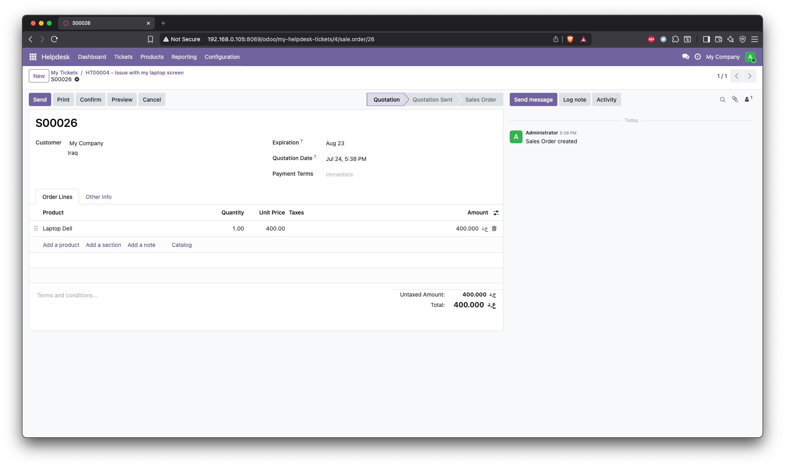

# Helpdesk Sale Quotation

Create Sales Quotations directly from Helpdesk Tickets in Odoo 19.

---

## Overview

This module extends the OCA Helpdesk application by allowing support agents to generate Sales Quotations directly from Helpdesk tickets.

Instead of manually creating a quotation in the Sales module, the agent can fill in product information inside the ticket and generate a quotation with a single click.

---

## Features

- Add quotation information to Helpdesk tickets
- Customer Reference Code
- Product selection
- Quantity
- Unit of Measure
- Unit Price
- Create Sales Quotation from the ticket
- Automatically create Sale Order Line
- Link the quotation back to the Helpdesk ticket
- Prevent duplicate quotation creation
- Automatic Product → UoM & Price filling
- Validation before quotation creation

---

## Technologies

- Odoo 19
- Python
- XML
- PostgreSQL

---

## Module Structure

```
helpdesk_sale_quotation/
│
├── models/
│   ├── __init__.py
│   └── helpdesk_ticket.py
│
├── security/
│   └── ir.model.access.csv
│
├── views/
│   └── helpdesk_ticket_views.xml
│
├── __manifest__.py
└── README.md
```

---

## Workflow

```text
Helpdesk Ticket

        │

        ▼

Fill Product Information

        │

        ▼

Click "Create Quotation"

        │

        ▼

Sale Order Created

        │

        ▼

Quotation Linked to Ticket
```

---

## Ticket Form

Additional fields added to Helpdesk Ticket:

| Field | Description |
|-------|-------------|
| Customer Reference Code | Customer reference or internal asset code |
| Product | Product to be quoted |
| Quantity | Requested quantity |
| Unit of Measure | Product UoM |
| Unit Price | Product selling price |
| Quotation | Link to generated quotation |

---

## Automatic Features

When a product is selected:

- Unit of Measure is filled automatically.
- Unit Price is filled automatically.

---

## Validation Rules

Before creating a quotation, the module checks:

- Customer must be selected.
- Product must be selected.
- Unit of Measure must be selected.
- A quotation must not already exist.

---

## Result

After clicking **Create Quotation**:

- Sale Order is created.
- Sale Order Line is created.
- Ticket is linked with the quotation.
- User is redirected to the quotation.

---

## Screenshots
### 1. Helpdesk Sale Quotation



### 1. Helpdesk Ticket

The Helpdesk Ticket includes an additional **Quotation Details** section.



## 2. Ticket with Quotation Details

Quotation information is completed before generating the Sales Quotation.



## 3. Generated Sales Quotation

The quotation is automatically generated from the Helpdesk Ticket.



## 4. Ticket Linked with the Quotation

The created quotation is linked back to the Helpdesk Ticket.


---

